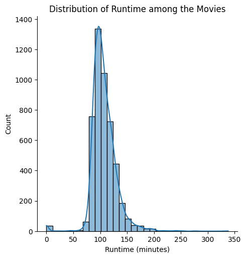
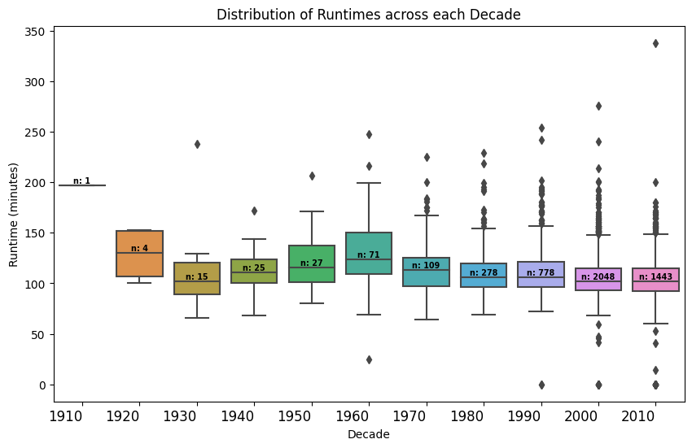
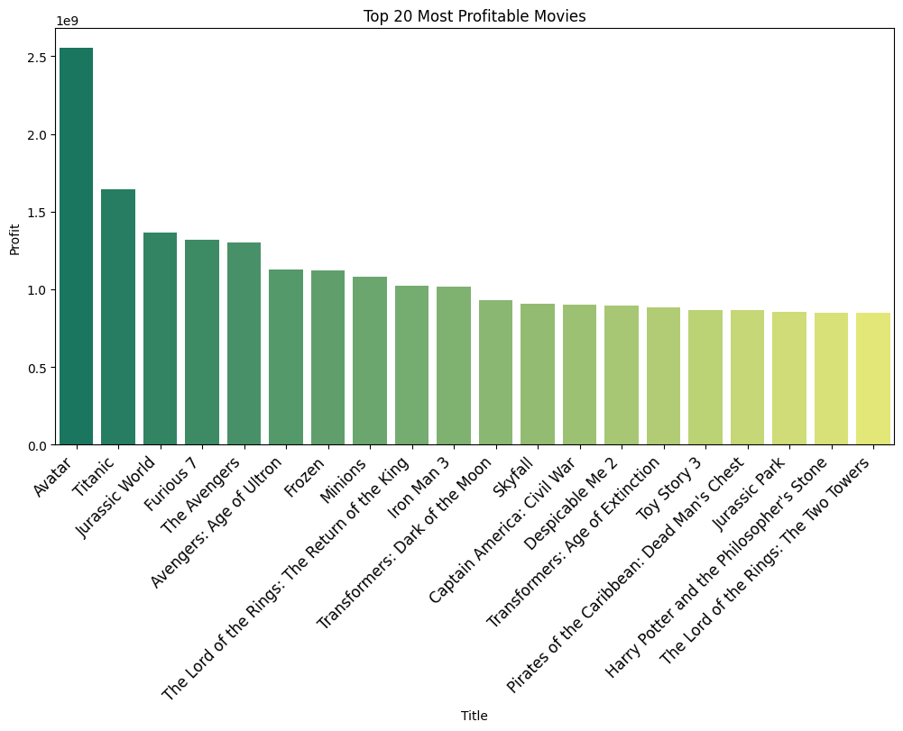
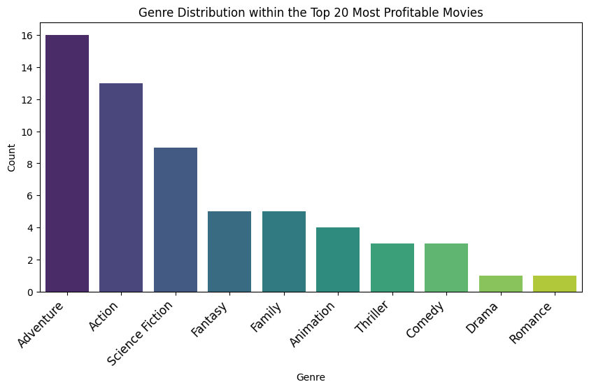

# TMDB-Dataset-EDA

 This repository contains the code and visualizations for an Analysis of the TMDB (The Movie Database) dataset. It involved getting the dataset cleaned and pre-processed, ready for an Exploratory Data Analysis (EDA).  

## Dataset

The TMDB dataset used in this project can be found [here](https://www.kaggle.com/datasets/tmdb/tmdb-movie-metadata). The dataset contains information about movies, including their title, budget, revenue, release date, and various other attributes.

## Visualizations

### 1. Movie Runtime Trends

This visualisation displays the distribution of runtime among the movies, providing insight into the common runtime of movies in the dataset. It appears that 90-120 minutes is the common runtime chosen by the production team which may be in response to the preferences of audiences. Understanding this common runtime can help filmmakers make informed decisions about the duration of their movies to cater to audience expectations and industry standards 

### 2. Movie Runtime Trends across each Decade

This box plot visualisation offers a deeper insight into the previous visualisation. Its a historical perspective on the distribution of movie runtimes across different decades. Taking into consideration that bigger sample sizes calls for better accuracy, we would ideally be observing the boxplots from 1960s onwards. It appears that the average runtime has been decreasing over time. This could possibly be influenced by evolving audience preferences, changing storytelling techniques, and the need for more concise narratives in today's fast-paced media landscape.

### 3. Top 20 Most Profitable Movies

This bar graph presents the top 20 most profitable movies in the dataset. Profitability was calculated as the difference between a movie's revenue and budget. 

### 4. Genre Distribution within the Top 20 Most Profitable Movies

To understand the common theme behind the most profitable movies, a visualisation was made to observe the genre distribution within the most profitable movies. By counting how many movies in the top 20 belong to each genre, it offers insights into which genres have been the most financially successful. The adventure and action genres seems to be the most popular genres suggesting that these genres have consistently resonated with audiences and proven to be strong contenders for generating high profits

## Dependencies

To run the code in this repository, you will need the following Python packages:

- pandas
- matplotlib
- seaborn
- ast

## Acknowledgments
The TMDB dataset was obtained from Kaggle.

